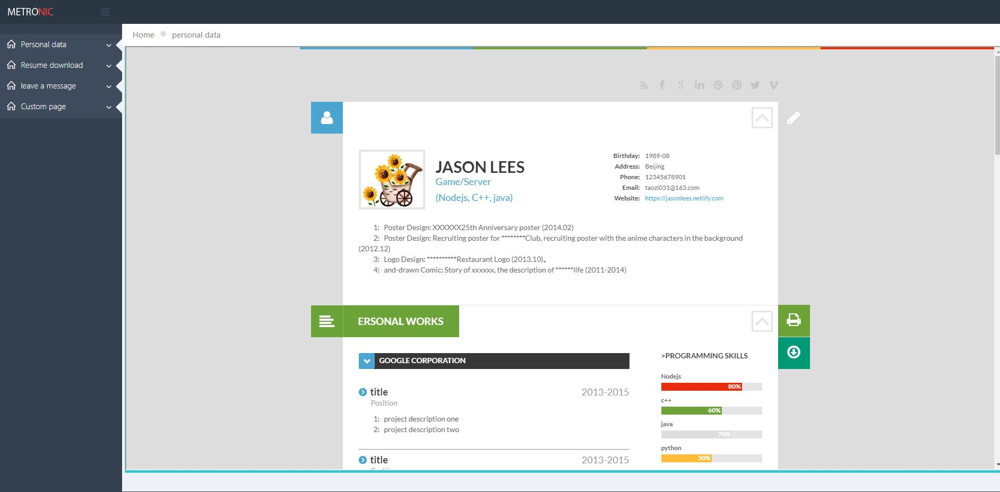
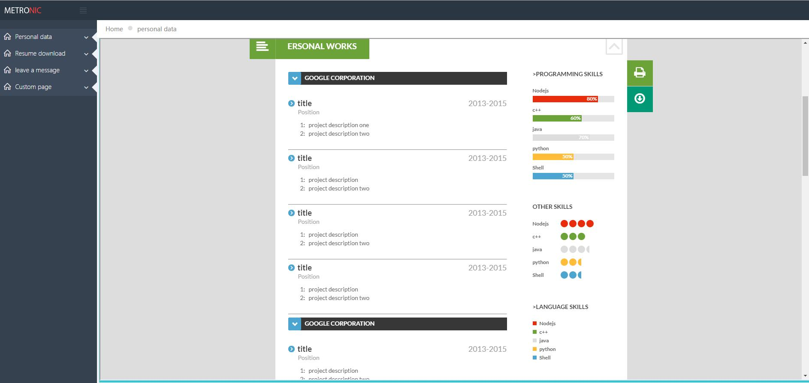
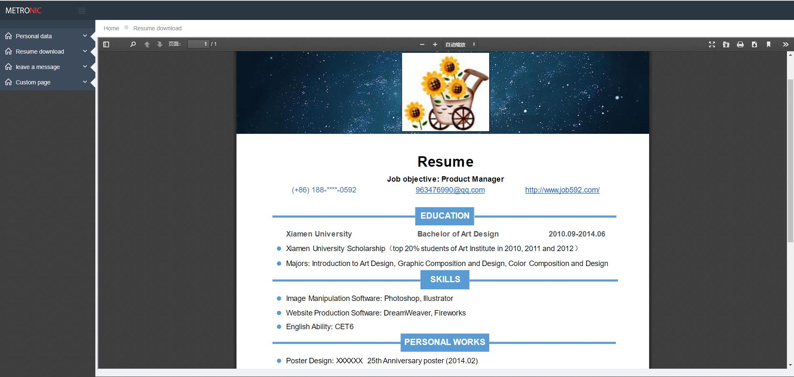
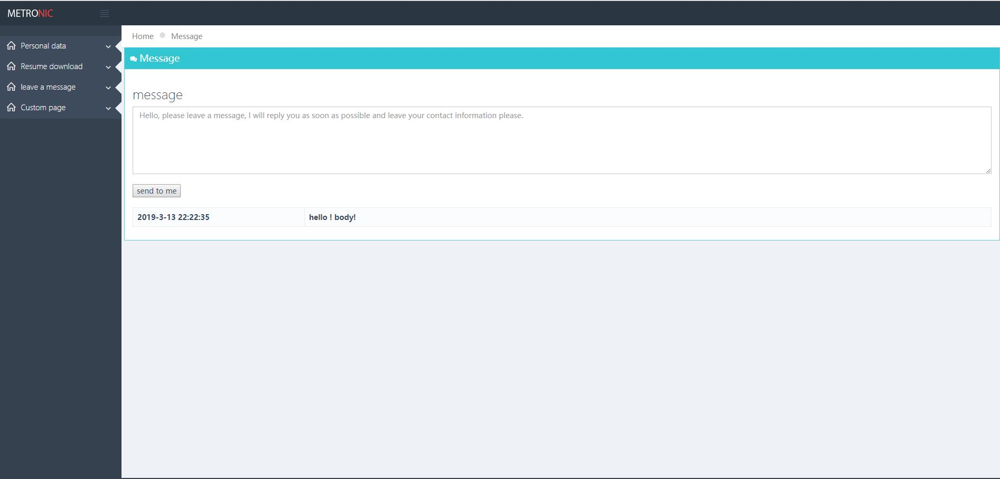

<h1 align="center">A Simple Resume Online System</h1>

<!-- <p align="center">Made by Nodejs and express</p> -->


## Overview

> This is a simple resume online system make by nodejs and express and without any databases system. Well it's simple and you can do whatever you want.

## Quick start

```sh
    1. git clone https://github.com/IceFrozen/resume-online.git
    2. cd resume-online
    3. npm install
    4. npm run start 
```
 > see [http://localhost:3000](http://localhost:3000)

 > [Demo Online](http://localhost:3000)

## Features

- No database
- Lightweight
- Less dependent

## How to upload your infomation?

  - see ./public/upload/person.json

---










